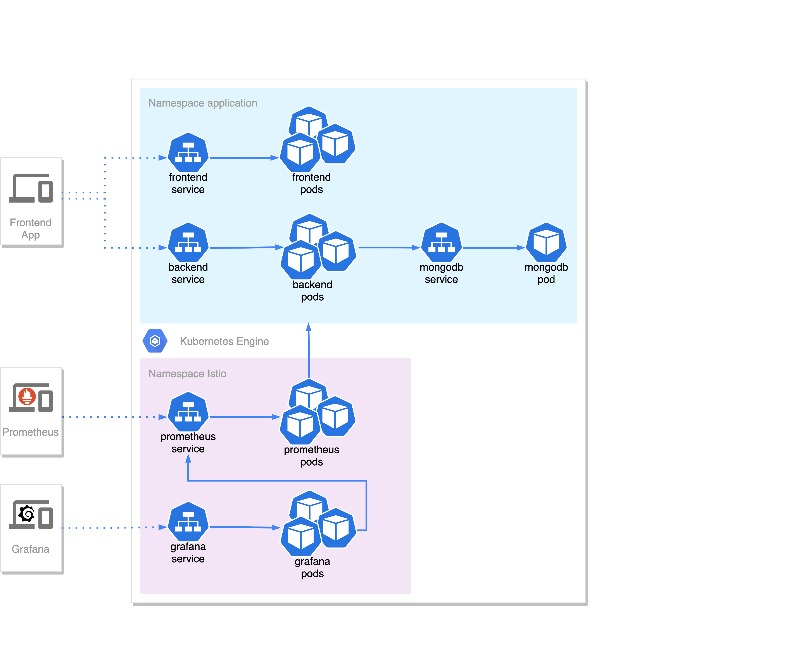

# Project README

AGISIT 2021-2022

## Authors

| Number | Name              | Username                                       | Email                                            |
| -------|-------------------|------------------------------------------------| -------------------------------------------------|
| 89406  | Marta Sousa       | <https://git.rnl.tecnico.ulisboa.pt/ist189406> | <mailto:ana.marta.sousa@tecnico.ulisboa.pt>      |
| 98624  | João Vieira       | <https://git.rnl.tecnico.ulisboa.pt/ist198624> | <mailto:joaofvieira@tecnico.ulisboa.pt>          |
| 98666  | Rodrigo Silva     | <https://git.rnl.tecnico.ulisboa.pt/ist198666> | <mailto:rodrigo.santos.silva@tecnico.ulisboa.pt> |

## Solution

Our system is comprised of 4 main components:
* Frontend - The client-side application (React)
* Backend - The server-side application (SpringBoot)
* Database - Database where data is stored (MongoDB)
* Monitoring system - Collects and displays metrics (Prometheus, Grafana)

## Implementation Options

The application repository is divided into three main folders:
* backend - Contains the backend application
* frontend - Contains the frontend application
* terraform - Contains all the necessary configuration files to deploy the system in GCP using Terraform and the Google Kubernetes Engine.

## Launching the system

After setting up `gcloud` and downloading the *json* key file.
* Create the `terraform.tfvars` file inside the `terraform` folder defining the `project`, `workers_count`and `region` variables
* Run `sh create-infrastructure-sh`
* After terraform finishes deploying, running `fetch-urls.sh` will output the addresses used to access the various application endpoints.

